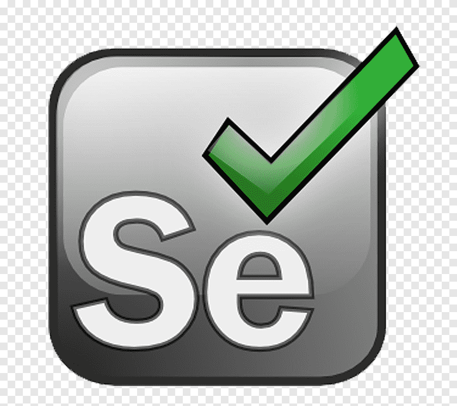

### Привет! Меня зовут Назиля.
---

 У меня 17 лет опыта работы в сфере ИТ, во внедрении и сопровождении. 
 

 С 2020 г. изучаю тестирование. Поступила на годовое обучение в GeekBrains, 
на факультет "Тестирование ПО". По окончании обучения получила диплом о профессиональной переподготовке.
С августа 2021 г. начала работать ручным тестировщиком.

На работе дополнительно прошла курс повышения квалификации сотрудников ПОИНТ 
(Первый ОНлайн Институт Тестировщиков).Получила сертификат <a target="_blank" href="https://qaschool.ru/school-center/certificate.php?id=22620"</a>
 

В настоящее время изучаю автоматизацию тестирования. 
Прохожу обучение в QA.GURU – в школе инженеров по автоматизации тестирования на Java.

 

  <code></code>
  <code></code>
  <code></code>
  <code></code>
  <code></code>
  <code></code>
  <code></code>
  <code></code>
  <code></code>
  <code></code>
  <code></code>
  <code></code>
  <code></code>
  <code></code>
  <code></code>

---

[NazilyaMullagildina](https://t.me/NazilyaMullagildina)  

<!--
**Nazilya/Nazilya** is a ✨ _special_ ✨ repository because its `README.md` (this file) appears on your GitHub profile.

Here are some ideas to get you started:

- 🔭 I’m currently working on ...
- 🌱 I’m currently learning ...
- 👯 I’m looking to collaborate on ...
- 🤔 I’m looking for help with ...
- 💬 Ask me about ...
- 📫 How to reach me: ...
- 😄 Pronouns: ...
- ⚡ Fun fact: ...
-->
